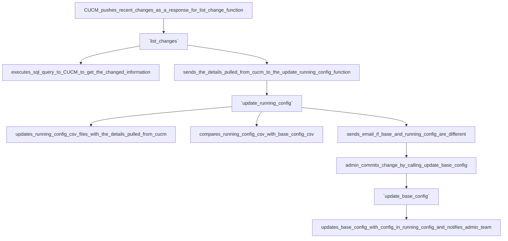

# Cisco-Unified-Communications-CUCM-Configuration-Tracker
[](https://developer.cisco.com/codeexchange/github/repo/usharanig92/Cisco-Unified-Communications-CUCM-Config-Tracker)

Scripts for managing Cisco Unified Communications Manager

## Use Case
This script is designed for continuous monitoring of configuration changes in Cisco Unified Communications Manager. When a change is detected that differs from the baseline configuration established during initial setup, it automatically notifies the admin team via email with details of the change. Admins can then review and either commit the change to the baseline (if intentional) or revert it (if accidental or temporary).

### Code Base Logic
The script uses the CUCM AXL List Change API to monitor for any changes in the database. List change API provides the following details if there are any changes in the system.

  **action** - indicates the type change: u is update, a is add, r is remove  
  **doGet** - Boolean value indicates when the client should perform a get operation to get the full details of the object.  
  **type** - Changed configuration item. Ex: DevicePool, RoutePattern, TransPattern.  
  **ChangedTags** - Contains name of the configuration field that was changed and the changed value. For example, Changed Configuration field is Description and the value is "Jon Doe".  
  Based on the action keyword, it can be determined whether this was the new add or update or remove.

Upon receiving the change details, based on the type, action and the change details, the script pulls the complete configuration details from CUCM using sql query and updates the corresponding running configuration file and emails the admin team notifiying the changed item and the procedure to commit the change to the base config.

## Installation

Clone the repo

```git

git clone https://github.com/usharanig92/Cisco-Unified-Communications-CUCM-Config-Tracker.git

```  

This script uses uv to install the required depenedencies. Run the script with the keyword `uv run <script_name>`

```bash
uv run cucmconfigtracker.py <arguments>
```

## Initial Setup
1. Create directories

 **BaseConfig** - Create the directory called baseconfig and copy the csv templates present under the template folder to store the base config.  
 **RunningConfig** - Create the directory called runningconfig in the same location as baseconfig. Nothing else needed.  

2. Initialize baseconfig
Copy the empty CSV templates from the template folder into baseconfig/.
The csv's that are copied into the baseconfig directory are empty files. When the script first runs, it creates csv files in the runningconfig directory and stores the current CUCM Configurations pulled using sql query.

3. First run
On the first run, the script queries CUCM and populates the runningconfig/ directory with the current configurations.

4. Establish the baseline
After verifying the current CUCM configurations are correct, copy the CSVs from runningconfig/ to baseconfig/. This establishes your baseline.

Note: Direct copying should only be done during initial setup. After that, use the script's commit functionality to update the baseline when changes are intentional.

## Usage
The script requires following parameters to create an AXL request to CUCM and monitor the configurations. 

**cucmpub** --> CUCM Publisher Hostname  
**cucm_axl_username** --> CUCM username which has AXL API access  
**cucm_axl_password** --> password for the above AXL username  
**cucm_cli_username** --> CUCM username which has admin CLI access  
**cucm_cli_password** --> Enter the password for the above CLI username  
**cucm_axl_api_wsdl_path** --> location to find the CUCM AXL API WSDL path for the version of your CUCM  
**config_relative_path** --> Enter the location of the baseconfig and runningconfig directory, that was created in the above step.

On first run, the script prompts for these values and stores them in ~/.cucmconfigtracker.json. On subsequent runs, it asks whether to reuse the saved configuration—select No to update any values.

Security Note: For production environments, use your organization's secure credential management system rather than storing passwords in the config file.

```bash
$ uv run cucmconfigtracker.py list_changes
Loaded config from /home/uganesan/.cucmconfigtracker.json
? Use saved configuration? No
? Enter the CUCM node name cucmpub.domain.com
? Enter the CUCM username which has AXL API access apireadonly
? Enter the password for the above AXL username ***********************
? Enter the CUCM username which has admin CLI access administrator
? Enter the password for the above CLI username ****************************
? Enter the location to find the CUCM AXL API WSDL path for the version of your CUCM /app/usr/uganesan/etc/axlsqltoolkit/schema/current/AXLAPI.wsdl
? Enter the location of the config relative path /app/usr/uganesan/cucm/configs/
Config saved to /home/uganesan/.cucmconfigtracker.json


Following parameters have been modified in the RoutePattern: [['authorizationcoderequired', 'clientcoderequired']] 


Base configs and running configs has been modified for 'RoutePattern'. 
Configs in Base Repo: 
╒════╤═══════════════╤═════════════════════════════╤══════════════════════╕
│    │   dnorpattern │ authorizationcoderequired   │ clientcoderequired   │
╞════╪═══════════════╪═════════════════════════════╪══════════════════════╡
│  6 │          1000 │ f                           │ f                    │
╘════╧═══════════════╧═════════════════════════════╧══════════════════════╛

Configs in Running Config: 
╒════╤═══════════════╤═════════════════════════════╤══════════════════════╕
│    │   dnorpattern │ authorizationcoderequired   │ clientcoderequired   │
╞════╪═══════════════╪═════════════════════════════╪══════════════════════╡
│  6 │          1000 │ t                           │ t                    │
╘════╧═══════════════╧═════════════════════════════╧══════════════════════╛

Following parameters have been modified in the RemoteCluster: [['version']] 

Base configs and running configs has been modified for 'RemoteCluster'. 
Configs in Base Repo: 
╒════╤═════════════╤═════════════════╕
│    │ clusterid   │ version         │
╞════╪═════════════╪═════════════════╡
│  0 │ HKGCluster  │ 15.0.1.13901(2) │
├────┼─────────────┼─────────────────┤
│  1 │ UKGCluster  │ 14.0.1.14901(1) │
╘════╧═════════════╧═════════════════╛

Configs in Running Config: 
╒════╤═════════════╤═════════════════╕
│    │ clusterid   │ version         │
╞════╪═════════════╪═════════════════╡
│  0 │ HKGCluster  │ 14.0.1.14901(1) │
├────┼─────────────┼─────────────────┤
│  1 │ UKGCluster  │ 15.0.1.13901(2) │
╘════╧═════════════╧═════════════════╛

Changes detected in 'ServiceParameter'. 
 Below configs have been added: 
 ╒═════╤══════════════════════════════════╤═════════╕
│     │ Param Name                       │   Value │
╞═════╪══════════════════════════════════╪═════════╡
│  53 │ ClusterSipTrunkBusyout           │       0 │
├─────┼──────────────────────────────────┼─────────┤
│ 132 │ TLS1_3CertificatePreferenceOrder │       0 │
├─────┼──────────────────────────────────┼─────────┤
│ 136 │ TLSSignatureAlgorithmPreference  │       1 │
╘═════╧══════════════════════════════════╧═════════╛

Base and Running configs has been modified
Initial listChange response:

{
    'queueInfo': {
        'firstChangeId': 1,
        'lastChangeId': 11145,
        'nextStartChangeId': 11146,
        'queueId': 'DdkNST9m'
    },
    'changes': None,
    'sequence': None
}

Starting loop to monitor changes...
(Press Ctrl+C to exit)

Action doGet? Type                 UUID                                 Field           Value
------ ------ -------------------- ------------------------------------ --------------- ---------------
Add    true   RoutePattern         bfb913ee-2591-41e8-37b9-8d4d7d4701b9
Update true   RouteList            5ccb2f72-373d-6018-5402-1992d57e0ff2
Update true   RoutePattern         bfb913ee-2591-41e8-37b9-8d4d7d4701b9
Update false  DevicePool           cd7885f1-c245-7a1a-18f5-17f2df6effcd name            Test-Device-DP
Update false  DevicePool           cd7885f1-c245-7a1a-18f5-17f2df6effcd
```


In the above output, we are running the list_change command and entering the CUCM host and credential information, location of the AXL API wsdl file and the location of the baseconfig and the runningconfig directory. The script creates an AXL connection to the CUCM, pulls the current running config and compares it with baseconfig csv's and outputs the differences. Then, it starts the continuous loop to monitor further configuration changes.





Please note that in the script, the configuration items that are to be monitored are mentioned under templates as a key value pair. Key indicates the name of the configuration item such as DevicePool, TransPattern, RoutePattern and value being the sql query to pull the details of those items. The format of key in the template variable is same as what the listChange API outputs when the particular configuration has changed. If you would like to add additional items to monitor, use the exact syntax for the configuration item mentioned in the AXL Schema Reference guide per your CUCM verison - https://developer.cisco.com/docs/axl-schema-reference/.

```bash
$ uv run cucmconfigtracker.py --h
Loaded config from /home/uganesan/.cucmconfigtracker.json
? Use saved configuration? Yes
usage: cucmconfigtracker.py [-h] {list_all_configs,check_running,update_base,check_all,list_changes,uconfigs_check} ...

Choose a command to run.

positional arguments:
  {list_all_configs,check_running,update_base,check_all,list_changes,uconfigs_check}
    list_all_configs    List all the available config items
    check_running       Compares running config and base config of entered config item and notifies about changes, if any.
    update_base         Update the base config with the most recent running config of the entered config item.
    check_all           Verifies all configs from the config items and notifies if there are any changes
    list_changes        List all the changes made in the database
    uconfigs_check      Command to run the monitoring check for all items, returns 0 if base and running configs are same, 1 if not

options:
  -h, --help            show this help message and exit
```

list_all_configs lists all the configuration items that this script currently monitors.

```bash
$ uv run cucmconfigtracker.py list_all_configs
Loaded config from /home/uganesan/.cucmconfigtracker.json
? Use saved configuration? Yes
Valid config items are:

AppUser
AudioCodecPreferenceList
CallManagerGroup
CallPark
CallingPartyTransformationPattern
CommonPhoneConfig
Css
DateTimeGroup
DevicePool
ExpresswayCConfiguration
ExternalCallControlProfile
FeatureGroupTemplate
GeoLocation
LdapFilter
LdapSearch
Location
MediaResourceList
MraServiceDomain
PhoneButtonTemplate
PhoneNtp
PhoneSecurityProfile
PhysicalLocation
RegionMatrix
RemoteCluster
RouteGroup
RouteList
RoutePartition
RoutePattern
ServiceParameter
ServiceProfile
SipProfile
SipRoutePattern
SipTrunk
SipTrunkSecurityProfile
SoftKeyTemplate
TransPattern
UcService
UserGroup
```

Initialize the script by selecting the command list_changes to initiate the listChange API request and for continuous monitoring. The script should remain running to:
1. Receive real-time configuration changes from CUCM  
2. Update the corresponding running config files and notifies administrator about the change  
3. Accept commit messages from administrators  

When an admin commits a change, a confirmation email is sent to the admin team containing:
1. Name of the committer  
2. Commit message  
3. Change details  

```bash
$ uv run cucmconfigtracker.py uconfigs_check
Loaded config from /home/uganesan/.cucmconfigtracker.json
? Use saved configuration? Yes
Changes detected for the items ['AppUser', 'DevicePool', 'ExpresswayCConfiguration', 'RemoteCluster', 'RouteList', 'RoutePattern', 'ServiceParameter', 'UserGroup', 'Imp_High_Availability_Status']
```

The ucconfigs_check compares baseconfig and runningconfig for all the above listed configuration items and list only the configuration element, which has the different base and running config.

## Tool Highlights
The biggest benefit of this tool is that, it works on push mechanism from CUCM instead of constantly polling CUCM for changes. This significantly reduces API load on the server and improves application efficiency. And this script uses sql query to pull the configurations from CUCM, which is a thin AXL API and does not consume high CPU or memory for execution.

